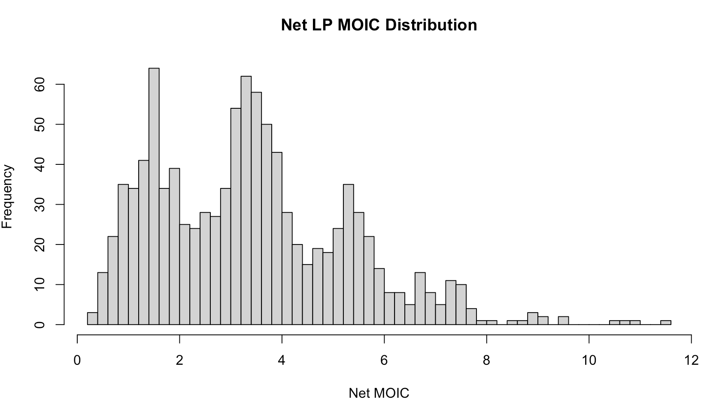
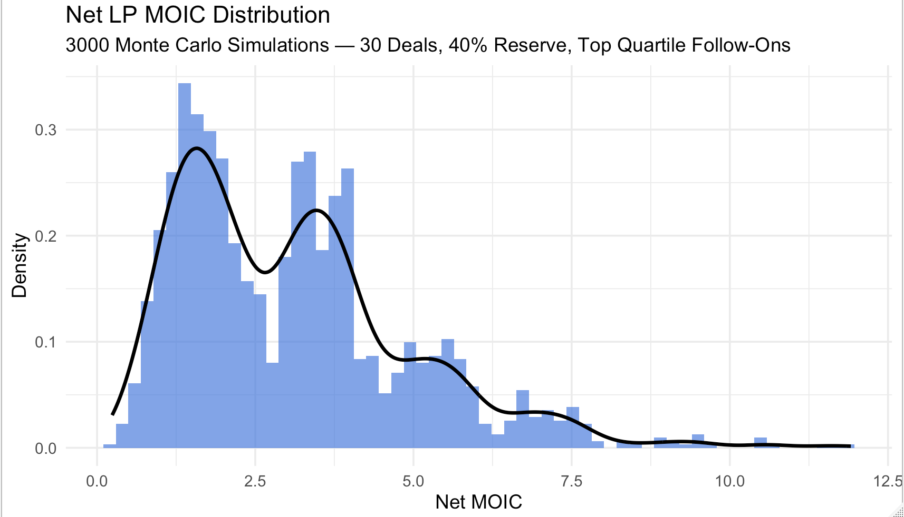
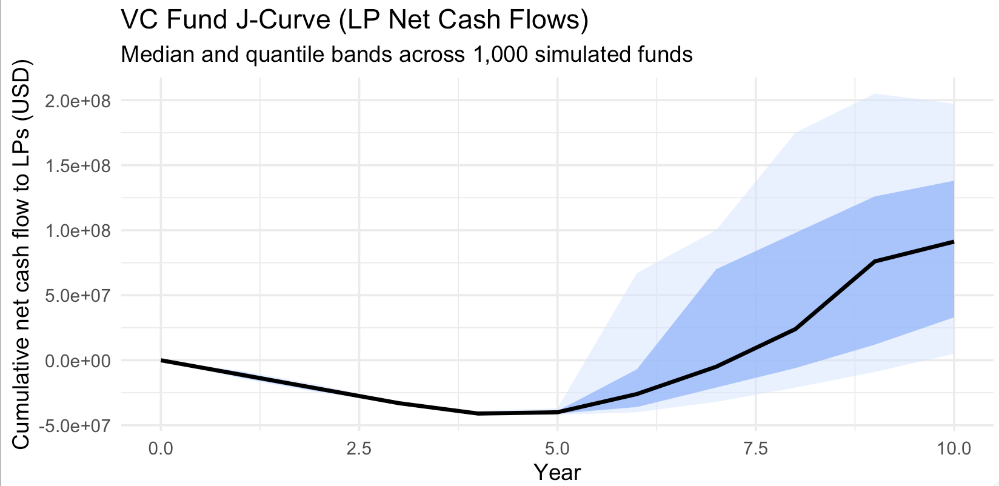

# VC Monte Carlo Simulator

[](https://www.r-project.org/)
[](https://aryashah.shinyapps.io/vcmontecarlosim/)
[](LICENSE)
[](https://github.com/aryashahprog/vc-montecarlo-simulator/commits/main)

A Monte Carlo engine for simulating **venture capital fund performance** — including **MOIC distributions, IRR outcomes, follow-on strategies, and LP J-curve cash flows** — with an interactive **Shiny dashboard**.

---

##  What This Project Is

This project answers a simple question:

> *“If I ran thousands of VC funds with a given strategy, what would the distribution of outcomes actually look like?”*

It models a venture fund from the perspective of **LPs and the GP**:

- Initial checks across a portfolio of startups  
- Follow-on capital reserved and deployed into “top quartile” deals  
- Exit timing based on outcome size (write-offs vs small wins vs big wins)  
- Gross vs net distributions after fees & carry  
- LP & GP cash flow timelines and the classic **J-curve**

All of this is exposed through a **Shiny app** so you can play with parameters instead of reading a PDF.

---

## 📌 Results TL;DR

In a baseline configuration:

- Fund size: **$50M**
- 30 initial portfolio companies  
- 40% of capital reserved for follow-ons  
- Simple power-law style outcome distribution  
- Follow-ons allocated to “top quartile” deals

The simulator typically shows:

- **Net LP MOIC** clustering around ~**3x**, with a long right tail  
- **Probability of ≥ 3x net MOIC** ≈ **55–60%** in this scenario  
- A clear **J-curve** where LPs are negative for the first few years before distributions start to dominate

These are **illustrative only** – not investment advice or a forecast – but they make the trade-offs around **portfolio size, reserves, and follow-ons** much more concrete.

---

## Why This Is Useful

This project is designed to demonstrate:

- **Quantitative intuition for venture**  
  - Power-law outcomes, skewed return distributions, and tail risk  
- **Ability to turn an idea into a working analytical tool**  
  - Clean, modular R code (`vc_fund_sim_core.R`)  
  - Monte Carlo engine + visualization layer + Shiny app  
- **Communication of complex topics**  
  - Visuals that LPs / PMs can understand at a glance  
  - Clear documentation and live demo

If you work in **VC, fintech, or data-driven investing**, this is the kind of tool I’d love to build more of.

---

## Core Features

### 1. VC Fund Engine (`vc_fund_sim_core.R`)

- Simulates **one full VC fund** path:
  - Committed capital, management fees, carry, hurdle
  - Initial checks & follow-ons
  - Exit years and multiples
  - LP & GP cash flows by year
- Pluggable outcome distributions:
  - Discrete “bucketed” distribution (0x, 1x, 3x, 10x, 50x, etc.)
  - Lognormal
  - Pareto (power-law style fat tails)
- Computes:
  - **Gross & net LP IRR**
  - **Gross & net LP MOIC**
  - **Total GP carry**

### 2. Monte Carlo Wrapper (`run_vc_monte_carlo()`)

- Runs **thousands of simulated funds** with the chosen parameters  
- Returns:
  - Raw simulation objects
  - A summary data frame for quick analysis and plotting

---

## Visuals

All charts are generated directly from the simulation outputs.

### Net LP MOIC – Base Histogram



Shows the raw distribution of fund outcomes (net MOIC). Most funds cluster around moderate outcomes, with a clear right tail.

### Net LP MOIC – Density + Tail Shape



A cleaner, publication-style view with density overlay to visualize skew and tail behavior.

### VC Fund J-Curve (LP Net Cash Flows)



Median and quantile bands for cumulative **net** cash flows to LPs across many simulated funds – a data-driven view of the classic VC J-curve.

---

## 🖥️ Interactive Shiny App

Try the live app here:

👉 **https://aryashah.shinyapps.io/vcmontecarlosim/**

What you can do in the app:

- Adjust **fund size, portfolio size, reserve ratio**
- Switch **follow-on strategy** and outcome distribution
- See how:
  - The **MOIC distribution** shifts  
  - The **probability of hitting ≥ X net MOIC** changes  
  - The **LP J-curve** steepens or flattens

---

## Tech Stack

- **R**
- **Shiny**
- **ggplot2**
- **dplyr**
- Monte Carlo simulation techniques

---

## ▶️ Run Locally

```r
# Clone
# git clone https://github.com/aryashahprog/vc-montecarlo-simulator.git

# Open project in RStudio

# Install dependencies
install.packages(c("shiny", "ggplot2", "dplyr"))

# Run app
source("shinyapp.R")
shinyApp(ui, server
```
---

## Author
Arya Shah
Georgia Tech – Business Administration (Finance / FinTech).

Lets connect 👉 [linkedin.com/in/aryashahcy](https://www.linkedin.com/in/aryashahcy/)

---

## License
This project is licensed under the MIT License. See LICENSE for details.
